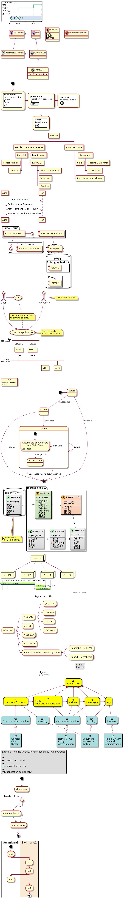

# plantuml-docker

PlantUML の Docker コンテナ実行環境

# build and test

```
docker build --no-cache -t plantuml:0.1 .
docker run -v --rm plantuml:0.1 -testdot
docker run -v --rm plantuml:0.1 -version
```

```
$ docker run -v --rm plantuml:0.1 -version 
PlantUML version 1.2020.15 (Sun Jun 28 11:39:45 UTC 2020)
(GPL source distribution)
Java Runtime: OpenJDK Runtime Environment
JVM: OpenJDK 64-Bit Server VM
Default Encoding: UTF-8
Language: en
Country: null
 
PLANTUML_LIMIT_SIZE: 4096

Dot version: dot - graphviz version 2.40.1 (20161225.0304)
Installation seems OK. File generation OK
```


# run sample

```
docker run -v ${PWD}:/work -w /work --rm plantuml:0.1 sample_plantuml/*.puml -o ../images
```

# サンプル

